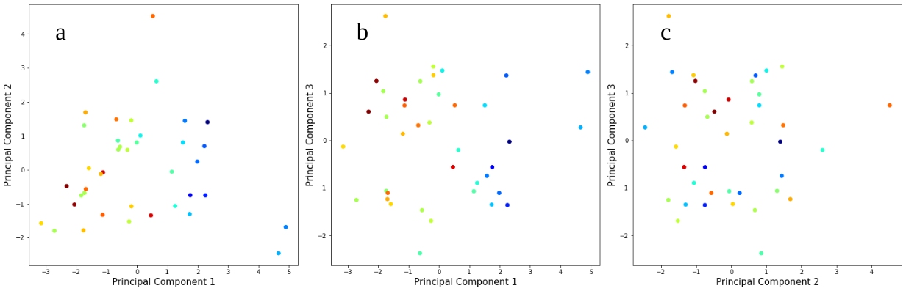

---
author-meta:
- "Juan Fern\xE1ndez-Gracia"
- "Juan M. Peric\xE0s"
- "V\xEDctor M. Egu\xEDluz"
- Joan Benach
bibliography:
- content/manual-references.json
date-meta: '2020-05-19'
header-includes: "<!--\nManubot generated metadata rendered from header-includes-template.html.\nSuggest improvements at https://github.com/manubot/manubot/blob/master/manubot/process/header-includes-template.html\n-->\n<meta name=\"dc.format\" content=\"text/html\" />\n<meta name=\"dc.title\" content=\"SDH mathematical model\" />\n<meta name=\"citation_title\" content=\"SDH mathematical model\" />\n<meta property=\"og:title\" content=\"SDH mathematical model\" />\n<meta property=\"twitter:title\" content=\"SDH mathematical model\" />\n<meta name=\"dc.date\" content=\"2020-05-19\" />\n<meta name=\"citation_publication_date\" content=\"2020-05-19\" />\n<meta name=\"dc.language\" content=\"en-US\" />\n<meta name=\"citation_language\" content=\"en-US\" />\n<meta name=\"dc.relation.ispartof\" content=\"Manubot\" />\n<meta name=\"dc.publisher\" content=\"Manubot\" />\n<meta name=\"citation_journal_title\" content=\"Manubot\" />\n<meta name=\"citation_technical_report_institution\" content=\"Manubot\" />\n<meta name=\"citation_author\" content=\"Juan Fern\xE1ndez-Gracia\" />\n<meta name=\"citation_author_institution\" content=\"IFISC (CSIC-UIB), Palma de Mallorca, Spain\" />\n<meta name=\"citation_author_orcid\" content=\"XXXX-XXXX-XXXX-XXXX\" />\n<meta name=\"twitter:creator\" content=\"@JuanFerGra\" />\n<meta name=\"citation_author\" content=\"Juan M. Peric\xE0s\" />\n<meta name=\"citation_author_institution\" content=\"Infectious Disease Department, Hospital Cl\xEDnic de Barcelona, Barcelona, Spain\" />\n<meta name=\"citation_author_institution\" content=\"Vall d\u2019Hebron Institute for Research (VHIR), Barcelona, Spain\" />\n<meta name=\"citation_author\" content=\"V\xEDctor M. Egu\xEDluz\" />\n<meta name=\"citation_author_institution\" content=\"IFISC (CSIC-UIB), Palma de Mallorca, Spain\" />\n<meta name=\"citation_author\" content=\"Joan Benach\" />\n<meta name=\"citation_author_institution\" content=\"GREDS-EMCONET, Department of Political and Social Sciences, UPF, Barcelona, Catalonia, Spain\" />\n<link rel=\"canonical\" href=\"https://juanfernandezgracia.github.io/SDH_epi_modeling_manu/\" />\n<meta property=\"og:url\" content=\"https://juanfernandezgracia.github.io/SDH_epi_modeling_manu/\" />\n<meta property=\"twitter:url\" content=\"https://juanfernandezgracia.github.io/SDH_epi_modeling_manu/\" />\n<meta name=\"citation_fulltext_html_url\" content=\"https://juanfernandezgracia.github.io/SDH_epi_modeling_manu/\" />\n<meta name=\"citation_pdf_url\" content=\"https://juanfernandezgracia.github.io/SDH_epi_modeling_manu/manuscript.pdf\" />\n<link rel=\"alternate\" type=\"application/pdf\" href=\"https://juanfernandezgracia.github.io/SDH_epi_modeling_manu/manuscript.pdf\" />\n<link rel=\"alternate\" type=\"text/html\" href=\"https://juanfernandezgracia.github.io/SDH_epi_modeling_manu/v/9bbe93d55d6d0f5cce95bf117cdc45fb440b1e82/\" />\n<meta name=\"manubot_html_url_versioned\" content=\"https://juanfernandezgracia.github.io/SDH_epi_modeling_manu/v/9bbe93d55d6d0f5cce95bf117cdc45fb440b1e82/\" />\n<meta name=\"manubot_pdf_url_versioned\" content=\"https://juanfernandezgracia.github.io/SDH_epi_modeling_manu/v/9bbe93d55d6d0f5cce95bf117cdc45fb440b1e82/manuscript.pdf\" />\n<meta property=\"og:type\" content=\"article\" />\n<meta property=\"twitter:card\" content=\"summary_large_image\" />\n<link rel=\"icon\" type=\"image/png\" sizes=\"192x192\" href=\"https://manubot.org/favicon-192x192.png\" />\n<link rel=\"mask-icon\" href=\"https://manubot.org/safari-pinned-tab.svg\" color=\"#ad1457\" />\n<meta name=\"theme-color\" content=\"#ad1457\" />\n<!-- end Manubot generated metadata -->"
keywords:
- Social Determinants of Health
- epidemics
- mathematical modeling
lang: en-US
manubot-clear-requests-cache: false
manubot-output-bibliography: output/references.json
manubot-output-citekeys: output/citations.tsv
manubot-requests-cache-path: ci/cache/requests-cache
title: SDH mathematical model
...

<small><em>
This manuscript
([permalink](https://juanfernandezgracia.github.io/SDH_epi_modeling_manu/v/9bbe93d55d6d0f5cce95bf117cdc45fb440b1e82/))
was automatically generated
from [juanfernandezgracia/SDH_epi_modeling_manu@9bbe93d](https://github.com/juanfernandezgracia/SDH_epi_modeling_manu/tree/9bbe93d55d6d0f5cce95bf117cdc45fb440b1e82)
on May 19, 2020.
</em></small>

## Authors

+ **Juan Fernández-Gracia** 
    {.inline_icon}
    [XXXX-XXXX-XXXX-XXXX](https://orcid.org/XXXX-XXXX-XXXX-XXXX)
    · {.inline_icon}
    [juanfernandezgracia](https://github.com/juanfernandezgracia)
    · {.inline_icon}
    [JuanFerGra](https://twitter.com/JuanFerGra) 
  <small>
     IFISC (CSIC-UIB), Palma de Mallorca, Spain
     · Funded by UIB postdoct program
  </small>

+ **Juan M. Pericàs**  
  <small>
     Infectious Disease Department, Hospital Clínic de Barcelona, Barcelona, Spain; Vall d’Hebron Institute for Research (VHIR), Barcelona, Spain
  </small>

+ **Víctor M. Eguíluz**  
  <small>
     IFISC (CSIC-UIB), Palma de Mallorca, Spain
  </small>

+ **Joan Benach**  
  <small>
     GREDS-EMCONET, Department of Political and Social Sciences, UPF, Barcelona, Catalonia, Spain
  </small>

## Abstract {.page_break_before}

Social determinants of health are typically not taken into account when building mathematical models of infectious diseases.
Here we address this issue by first analysing data on social determinants and their relation to COVID-19 prevalence and then by developing mechanistic models that take into account social determinants explicitly, in order to exemplify how to do it and their consequences.

## Introduction

Social determinants of health are defined as the economic and social conditions that influence individual and group differences in health status. 

The general idea behind this work is that social determinants of health are crucial for the understanding of the different impacts of an epidemic on different social groups. 
It is clear during the present pandemic at the level of countries, that healthy ones are able to apply social distancing and hygiene measures that are much more difficult -or even impossible- in developing countries. 
This is also true at lower scales as within countries or even within cities (**cite papers inequalities and COVID-19 in the US**).
Many mathematical modeling efforts have been made for the forecasting of epidemics, but only few have incorporated social determinants of health into them explicitly.

## Theoretical framework

One point to take into account is that deaths in residencies for the elder have their own logic and thus should be treated differently in the analysis. 
*Health care workers pose a similar challenge in the analysis and modeling. (???)*
Regarding the rest of the population one can divide the social determinants impacting their risk during an epidemic at least into the following classes and subclasses:

1. **Inequality**. Indices that reflect material deprivation.
  - *Housing*. Overcrowding is a driver of contagion.
  - *Unemployment*. Unemployment leads to lower income levels and thus material deprivation, but also to lower mobility.
  - *Occupation*. Depending on the type of job, working from home can be possible or not.
2. **Population density**. A crowded living environment leads also to an enhanced frequency of close contacts, fostering contagion.
3. **Public transport**. The use of public transport modes is also a strong driver of close contacts, leading again to high contagion risks.

## Data analysis (WORK IN PROGRESS)

The approach is to analise the data for the social determinants of health that we want to consider at a certain spatial aggregation scale and find which ones and how correlate with the impact of the COVID-19 epidemic. For that we will explore different methods of dimensionality reduction (principal component analysis, tsne...).

The data is divided into two groups:

1. Epidemiological data.
    - Prevalence (can be taken at different times).
    - Deaths (can be taken at different times).
    - Observed mortality rate (dividing deaths by prevalence).
    - Seroprevalence (**GET DATA FROM ONGOING STUDY IN SPAIN**).

2. Social determinants of health.
    - Population.
    - Population density.
    - Sex.
    - Age.
    - Share of migrant population.
    - Housing.
        - Number of persons per home.
        - Size of homes.
    - Occupation.
    - Unemployment.
    - Income.
    - Mobility.

### Spain at the level of povinces (**PRELIMINARY RESULTS**)

For this aggregation scale we used the following datasets:

1. Epidemiological data from [Escovid19data](https://github.com/montera34/escovid19data), which offers the data by provinces in Spain..
    - Prevalence (can be taken at different times).
    - Deaths (can be taken at different times).
    - Observed mortality rate (dividing deaths by prevalence).

2. Social determinants of health.

    -Population from [INE](https://www.ine.es/censos2011_datos/cen11_datos_resultados_seccen.htm). From the census 2011 at the level of censal sections and aggregated up to provinces.
    The level of census sections is very detailed, but due to statistical secret some variables are not given and thus we to make some assumptions on them. 
    I am taking them as 0 for now. 
    Ideally I would change this dataset for one at the level of provinces with no missing data.
    - Age also from [INE](https://www.ine.es/censos2011_datos/cen11_datos_resultados_seccen.htm). From the census 2011 at the level of censal sections and aggregated up to provinces. We count the percentage of people over 64 for this variable.
    - Share of migrant population also from [INE](https://www.ine.es/censos2011_datos/cen11_datos_resultados_seccen.htm). We count the share of foreigners.
    - Housing.
        - Number of persons per house also from [INE](https://www.ine.es/censos2011_datos/cen11_datos_resultados_seccen.htm). We divide the population of a province by the number of homes that are there. Note that this does not tell if the home is big or small for the number of people living there.
    - Unemployment also from [INE](https://www.ine.es/jaxiT3/Tabla.htm?t=3996), this time directly at the level of provinces
    - Mobility taken from the mobility declared for work in the [census 2011](https://www.ine.es/censos2011_datos/cen11_datos_resultados.htm). This data contains mobility between municipalities (declared residence and declared work place). We aggregated the data at the level of provinces and defined three indicators of mobility.
        - Intra-mobility, taken as the number of people moving between municipalities of the same province.
        - In-mobility, taken as the number of people coming to work at the focal province.
        - Out-mobility, taken as the number of people going to work to some other province.
    - Deprivation index from [this paper](https://www.sciencedirect.com/science/article/pii/S0213911119302729?via%3Dihub). The data for the deprivation index is available [here](https://www.seepidemiologia.es/gruposdetrabajo.php?contenido=gruposdetrabajosub6).

Note that, from the variables that we listed in the previous section, there are some missing in the present version of this analysis. These ones will be added and are *population density, sex, size of homes, income* and *occupation*. Note also that mobility here is only between municipalities for work as described in the census of 2011 and that there is no distinction made between public and private transport.

We applied principal component analysis (PCA) to the determinants of health, leaving out all of the epidemiological indicators, to later assess their relation.

{#fig:pca_prov}

We see from Fig. @fig:pca_prov that there is correlation between the principal components and the prevalence of confirmed cases. 
Let's dig deeper in that relation. 
First let's see the weight of each variable for the principal components in Tab. @tbl:pca_prov.

|   | Var. explained | Pop.|Pop. over 64 | Migrants | People/home | Unemployment | Intra mob. | In mob. | Out mob. | Depriv. index |
|---|------------------|-----|-------------|----------|-------------|--------------|------------|---------|----------|---------------|
| PC1 | 38% | 0.11 | -0.45 | 0.04 | 0.47 |  0.44 | -0.23 | -0.40 | -0.39 | -0.06 |
| PC2 | 22% | 0.53 | -0.12 | 0.26 | -0.21 |  -0.30 | 0.54 | -0.19 | -0.41 | -0.08 |
| PC3 | 15% | -0.01 | -0.30 | 0.73 | 0.21 |  -0.22 | -0.21 | 0.41 | 0.16 | 0.23 |

Table: Principal components. {#tbl:pca_prov}

As the first prioncipal component seems to be the one correlating most with prevalence of COVID-19 confirmed cases by province, let's do scatter plots of incidence and the most relevant social determinants for that component.

{#fig:scatter_prov}

From Fig. @fig:scatter_prov we can identify several trends. First of all the more persons per home, the less prevalence. I think we should include a measure of the size of homes, as this result is very puzzling. Second, the share of people over 64 is a strong driver of prevalence of the disease. Third, the more unemployment, the less prevalence. *Might be because of less mobility?* Fourth, the more mobility, the more incidence.

### Catalonia at the level of ABS (**TO DO**)

## References {.page_break_before}

<!-- Explicitly insert bibliography here -->

